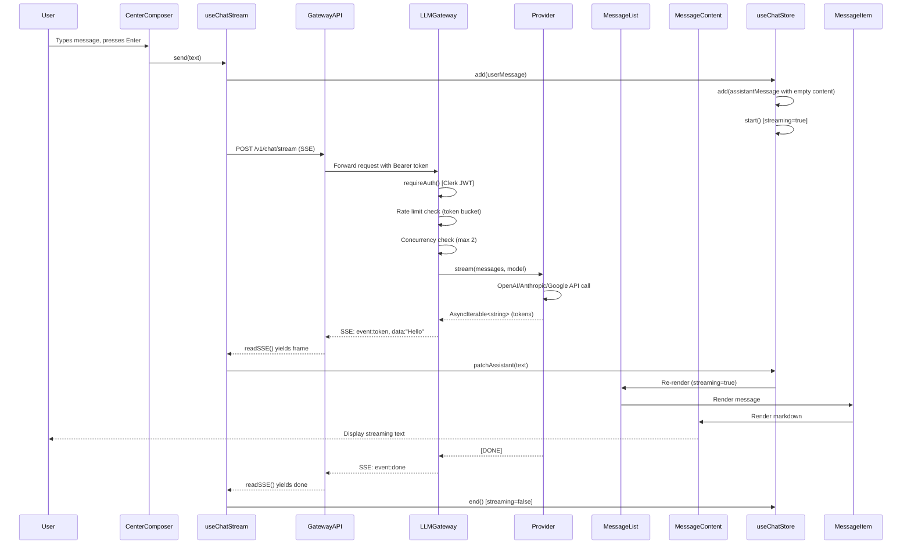

# 50/50 Chat+Artifact Feature Audit

**Date**: 2025-01-27  
**Audit Version**: 1.0.0  
**Scope**: READ-ONLY audit for adding 50/50 split view (left=Chat, right=Artifact Creation)

---

## Executive Summary

This audit examines the current codebase architecture to blueprint a 50/50 split view feature where users can interact with chat on the left while viewing/creating artifacts (tables, documents, spreadsheets) on the right. The system currently supports:

- ✅ Full chat pipeline with SSE streaming
- ✅ Zustand state management for conversations
- ✅ Fastify-based backend with Clerk authentication
- ✅ Research pipeline with web search integration
- ✅ Memory service for conversation context
- ❌ **NO existing artifact creation/export functionality**
- ❌ **NO tool-calling mechanism for artifact triggers**
- ❌ **NO split-view UI components**

---

## Current Architecture

### Tech Stack

- **Frontend**: React 18, TypeScript, Vite, Tailwind CSS, Zustand
- **Backend**: Fastify (Node.js), TypeScript
- **Database**: SQLite (better-sqlite3) with WAL mode
- **Auth**: Clerk (JWT tokens)
- **Streaming**: Server-Sent Events (SSE)
- **State**: Zustand stores
- **UI Framework**: Tailwind CSS + custom glass morphism effects

### Monorepo Structure

```
apps/
  web/              # React frontend (Vite)
  llm-gateway/      # Fastify chat backend
  memory-service/   # Background memory processing
packages/
  shared/           # Shared types & schemas (Zod)
```

---

## File Map: Chat Pipeline

### Frontend (apps/web/src)

#### Chat UI Components
- **`components/home/CenterComposer.tsx`** (line 1): Main message input with auto-resize textarea
- **`components/chat/MessageList.tsx`** (line 1): Renders list of messages with scroll handling
- **`components/chat/MessageItem.tsx`** (line 1): Individual message component with copy/thumbs UI
- **`components/chat/MessageContent.tsx`**: Markdown renderer (headers, bold, lists, code blocks)
- **`components/chat/ThinkingIndicator.tsx`**: Loading animation for assistant thinking
- **`components/chat/SourcesDropdown.tsx`**: Displays research sources

#### Layout & Routing
- **`layouts/MainChatLayout.tsx`** (line 1): Main layout with Sidebar, TopBar, MessageList, CenterComposer
- **`App.tsx`** (line 1): Root app with React Router, ErrorBoundary, auth guards

#### State Management
- **`store/chatStore.ts`** (line 1): Zustand store for conversations, messages, streaming state
  - State: `conversations[]`, `currentThreadId`, `streaming`, `activeStreams`, `thinkingSteps[]`
  - Actions: `add()`, `patchAssistant()`, `start()`, `end()`, `newConversation()`

#### Chat Hooks & Services
- **`hooks/useChatStream.ts`** (line 1): Main hook for sending messages and handling SSE streams
  - `send(text)`: Creates user/assistant messages, opens SSE connection
  - Handles events: `delta`, `message`, `done`, `error`, `research_thinking`, `sources`
- **`services/gateway.ts`** (line 1): HTTP client for gateway API
  - `fetchMessages()`, `sendMessage()`: REST endpoints
- **`lib/sse.ts`** (line 1): SSE reader utility (async generator)

#### Message Rendering
- **`components/chat/MessageContent.tsx`**: Custom markdown renderer
  - Supports: headers (#, ##, ###), bold (**text**), lists (-, 1.), code blocks
  - **NO table rendering detected**
  - **NO artifact/attachment widgets**

### Backend (apps/llm-gateway/src)

#### API Routes
- **`routes.ts`** (line 54): Main route registration
  - `POST /v1/chat/stream` (line 71): SSE streaming endpoint
    - Auth: Clerk JWT via `requireAuth` plugin
    - Rate limiting: Token bucket (10 tokens, 1 token/sec refill)
    - Concurrency: Max 2 concurrent streams per user
    - Streaming: SSE events (`token`, `done`, `error`, `heartbeat`)

#### Provider Layer
- **`providers/openai.ts`** (line 5): OpenAI streaming implementation
- **`providers/anthropic.ts`**: Anthropic streaming (Claude)
- **`providers/google.ts`**: Google streaming (Gemini)
- **`ProviderPool.ts`**: Provider management

#### Query Intelligence
- **`Router.ts`** (line 6): Smart model routing based on query characteristics
- **`QueryAnalyzer.ts`**: Intent detection for web search triggers
- **`PipelineOrchestrator.ts`**: Orchestrates research, memory, web search

#### Database
- **`database.ts`** (line 8): SQLite database with messages table
  - Schema: `messages(id, thread_id, user_id, role, content, created_at, meta, tokens_input, tokens_output)`
  - Indexes: `idx_messages_thread_time`, `idx_messages_user_thread`

#### Auth & Middleware
- **`plugins/clerkAuth.ts`** (line 1): Clerk JWT verification plugin
- **`server.ts`** (line 1): Fastify server setup with CORS, compress, auth hooks

### Shared (packages/shared/src)

#### Schemas (Zod)
- **`schemas.ts`** (line 1):
  - `ChatStreamRequestSchema`: `{thread_id?, messages[], model?, provider?, max_tokens?, temperature?}`
  - `ChatStreamEventSchema`: `{event: 'heartbeat'|'token'|'done'|'error', data?, meta?}`
  - **NO artifact schema exists**

#### Types
- **`types.ts`** (line 1): Provider types, Message interface
- **`memory-schemas.ts`** (line 7): Memory/audit schemas

---

## Sequence Diagram: Message Send → LLM → Stream → Render



---

## Data Contracts

### Message Schema

**Frontend** (`store/chatStore.ts:2-9`):
```typescript
type Msg = {
  id: string;                    // nanoid()
  role: "user" | "assistant" | "system";
  content: string;               // Markdown text
  sources?: Array<{              // Optional research sources
    title: string;
    host: string;
    url?: string;
    date?: string;
  }>;
};
```

**Backend** (`database.ts:31-44`):
```sql
CREATE TABLE messages (
  id INTEGER PRIMARY KEY AUTOINCREMENT,
  thread_id TEXT NOT NULL,
  user_id TEXT,
  role TEXT NOT NULL CHECK(role IN ('user', 'assistant', 'system')),
  content TEXT NOT NULL,
  created_at INTEGER NOT NULL DEFAULT (unixepoch('now')),
  meta JSON,                     -- Flexible metadata
  tokens_input INTEGER,
  tokens_output INTEGER,
  deleted_at INTEGER
);
```

### Tool-Call Schema

**❌ NOT FOUND**: No tool-calling mechanism exists in current codebase.

**Expected (for artifacts)**:
```typescript
type ToolCall = {
  id: string;
  type: "function" | "artifact_create";
  name: "create_table" | "create_document" | "create_spreadsheet";
  arguments: {
    columns?: string[];
    rows?: any[][];
    sections?: Array<{ title: string; content: string }>;
    sheets?: Array<{ name: string; cells: Record<string, any> }>;
  };
};
```

### Artifact Schema

**❌ NOT FOUND**: No artifact storage or schema exists.

**Proposed**:
```typescript
type Artifact = {
  id: string;
  thread_id: string;
  user_id: string;
  type: "table" | "document" | "spreadsheet";
  data: {
    columns?: string[];
    rows?: any[][];
    sections?: Array<{ title: string; content: string }>;
    sheets?: Array<{ name: string; cells: Record<string, any> }>;
  };
  created_at: number;
  updated_at: number;
  export_url?: string;           // S3/Supabase/GCS URL for PDF/DOCX/XLSX
};
```

---

## Gaps and Risks

### High Severity

#### GAP-001: No Tool-Calling Infrastructure
**Location**: Entire codebase  
**Evidence**: No `Tool`, `Action`, `FunctionCall` types or handlers found  
**Impact**: Cannot trigger artifact creation from LLM responses  
**Remediation**: 
1. Extend `ChatStreamEventSchema` to include `tool_call` events
2. Add tool registry in `routes.ts` (similar to provider pool)
3. Handle tool calls in streaming response (after `done` or mid-stream)
4. Add tool-call rendering in `MessageContent.tsx`

#### GAP-002: No Artifact Storage/Export Pipeline
**Location**: Entire codebase  
**Evidence**: No PDF/DOCX/XLSX generation libraries or storage SDKs detected  
**Impact**: Cannot generate or store artifact files  
**Remediation**:
1. Add libraries: `pdfkit` (PDF), `docx` (DOCX), `exceljs` (XLSX)
2. Create storage service (S3/Supabase/GCS) or local file system
3. Add `POST /api/artifacts/export` endpoint
4. Implement file generation workers (non-blocking)

#### GAP-003: No Split-View UI Components
**Location**: `layouts/MainChatLayout.tsx`  
**Evidence**: Single-column layout; no resizable panels  
**Impact**: Cannot render 50/50 split without breaking existing chat  
**Remediation**:
1. Add `react-resizable-panels` or custom resize logic
2. Create `ArtifactPane` component with tabs (Table|Document|Spreadsheet)
3. Update `MainChatLayout.tsx` to conditionally render split view
4. Add route param `?view=split` and Zustand state `ui.splitView`

#### GAP-004: No Natural-Language → Artifact Trigger
**Location**: `routes.ts`, `QueryAnalyzer.ts`  
**Evidence**: Query analyzer only triggers web search, not artifacts  
**Impact**: LLM cannot decide "create artifact vs chat-only"  
**Remediation**:
1. Add pre-LLM classifier (see `TRIGGER_SPEC.md`)
2. OR extend LLM tool-calling to include artifact tools
3. Add confidence threshold (≥0.7) to avoid false positives

### Medium Severity

#### GAP-005: No Table Rendering in Markdown
**Location**: `components/chat/MessageContent.tsx`  
**Evidence**: Markdown renderer only supports headers, bold, lists, code  
**Impact**: Tables in LLM responses won't render properly  
**Remediation**: Add table parsing (markdown `|col1|col2|`) and HTML table rendering

#### GAP-006: Rate Limiting Too Restrictive for Artifacts
**Location**: `routes.ts:27-42`  
**Evidence**: Token bucket allows 10 tokens, 1/sec refill; max 2 concurrent streams  
**Impact**: Artifact export (large file generation) may hit rate limits  
**Remediation**: Separate rate limiters for chat vs artifact endpoints

#### GAP-007: No Artifact Telemetry
**Location**: `metrics.ts`, `routes.ts`  
**Evidence**: Metrics only track chat/memory, not artifact operations  
**Impact**: Cannot monitor artifact creation/export success rates  
**Remediation**: Add events: `artifact_created`, `artifact_exported`, `artifact_failed` (see `EVENTS.md`)

### Low Severity

#### GAP-008: No Artifact Preview in Messages
**Location**: `MessageItem.tsx`, `MessageContent.tsx`  
**Evidence**: Messages only render text/sources, no embedded artifacts  
**Impact**: Users can't see artifact previews inline  
**Remediation**: Add `<ArtifactPreview artifactId={...} />` component

#### GAP-009: No Artifact Versioning
**Location**: Entire codebase  
**Evidence**: No versioning system exists  
**Impact**: Cannot track artifact edits over time  
**Remediation**: Add `version` field to artifact schema, store diffs

---

## Current Capabilities Assessment

### ✅ What Works

1. **Chat Pipeline**: End-to-end streaming with SSE, proper error handling
2. **State Management**: Zustand store with conversation/message persistence
3. **Authentication**: Clerk JWT with proper user isolation
4. **Rate Limiting**: Token bucket per user with concurrency limits
5. **Markdown Rendering**: Basic markdown (headers, bold, lists, code)
6. **Research Integration**: Web search with source attribution
7. **Memory System**: Background memory processing (non-blocking)

### ❌ What's Missing

1. **Tool-Calling**: No function calling or tool registry
2. **Artifact Generation**: No PDF/DOCX/XLSX libraries
3. **File Storage**: No S3/Supabase/GCS integration
4. **Split-View UI**: No resizable panels or artifact pane
5. **Table Rendering**: Markdown tables not supported
6. **Artifact Triggers**: No natural-language → artifact classifier
7. **Export Endpoints**: No `/api/artifacts/*` routes

---

## Recommendations

1. **Phase 1**: Implement gatekeeper classifier (pre-LLM) for artifact detection
2. **Phase 2**: Add split-view UI shell (empty artifact pane) behind feature flag
3. **Phase 3**: Extend LLM streaming to support tool-call events
4. **Phase 4**: Implement table artifact MVP (in-memory, no export yet)
5. **Phase 5**: Add file generation (PDF/DOCX/XLSX) and storage
6. **Phase 6**: Wire up telemetry and add rate limits for artifact ops

See `PLAN.md` for detailed phased rollout.
