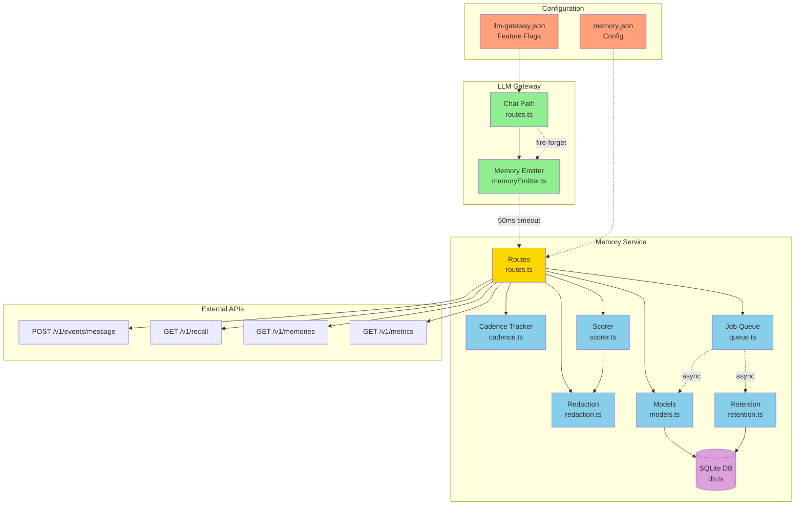

# Memory System Dependency Graph

## Flow Summary

1. **Gateway Chat Path**: User message → `routes.ts` handles streaming
2. **Fire-and-Forget**: `routes.ts` emits message event via `memoryEmitter.ts` with 50ms timeout
3. **Memory Service**: Event received at `/v1/events/message` → `routes.ts` records via `CadenceTracker`
4. **Trigger**: When cadence thresholds met (6 msgs OR 1500 tokens OR 3 min) → enqueue audit job
5. **Processing**: Job queue processes audit → score messages → redact PII → save to DB
6. **Storage**: SQLite with optimized PRAGMAs (WAL, NORMAL sync, 256MB mmap)
7. **Retrieval**: `/v1/recall` query with 30ms deadline, tier-based ordering (TIER2 > TIER1 > TIER3)
8. **Background**: Retention job runs daily for TTL enforcement and decay

## Key Interfaces

- **MessageEvent**: `{userId, threadId, msgId, role, content, tokens, timestamp}`
- **CadenceState**: `{msgCount, tokenCount, lastMsgTime, firstMsgTime, lastAuditTime}`
- **Memory**: `{id, userId, threadId, content, entities, priority, tier, redactionMap, ...}`
- **Job**: `{id, type, priority, payload, createdAt, attempts}`

## Isolation Boundaries

- ✅ Memory operations are **never blocking** chat path (fire-and-forget + timeout)
- ✅ Job queue is **in-process** (no external dependencies during normal operation)
- ✅ Retrieval has **30ms deadline** and graceful timeout fallback
- ✅ Cadence tracker is **in-memory** (resilient to service restarts)
- ✅ DB uses **WAL mode** for concurrent reads during writes

## Research Daemon Integration Points

Future integration for `Research Daemon`:
1. Query `/v1/recall` with semantic filters
2. Subscribe to audit completion events
3. Access tier metadata for RAG augmentation
4. Trigger manual audits via `/v1/jobs/audit`

